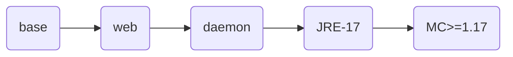

# mcsm-image-stacks

## 如果您通过github访问本项目，请注意
1. github上的仓库是由源仓库推送的镜像仓库，是gitlab的镜像仓库，具体实现可以参考 https://docs.gitlab.com/ee/user/project/repository/mirror/  
2. 我们的源仓库是 https://eoelab.org:1031/build-image-stacks/mcsm-image-stacks
3. 我们的docker镜像仓库是 https://hub.docker.com/r/ben0i0d/mcsm
4. 对于issue/PR，我们推荐在源仓库上提，这对于我们工作更方便，但是如果您在github上提，我们也会跟进处理  
## 梗概
1. 用于构建游戏服务器镜像项目，构建mcsm镜像在K8S上提供服务
2. 使用单纯的容器不利于可视化，打包mcsm daemon到镜像中利于使用  

**使用时务必注意持久化数据**

## 镜像依赖关系

## 上游
MCSmanager：https://github.com/MCSManager/MCSManager  